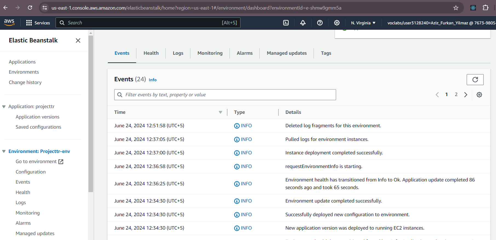
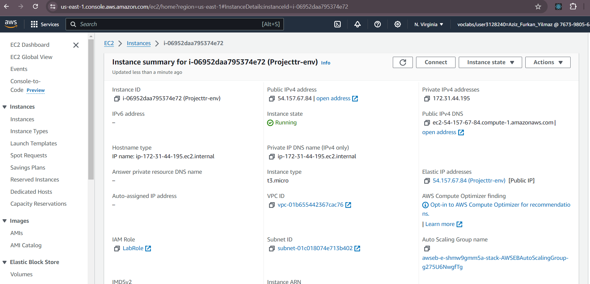
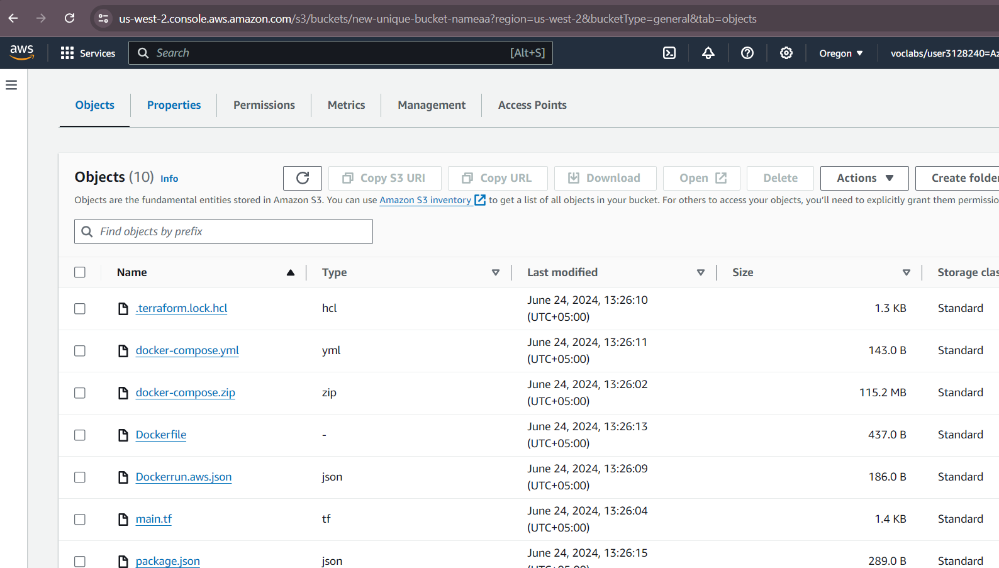
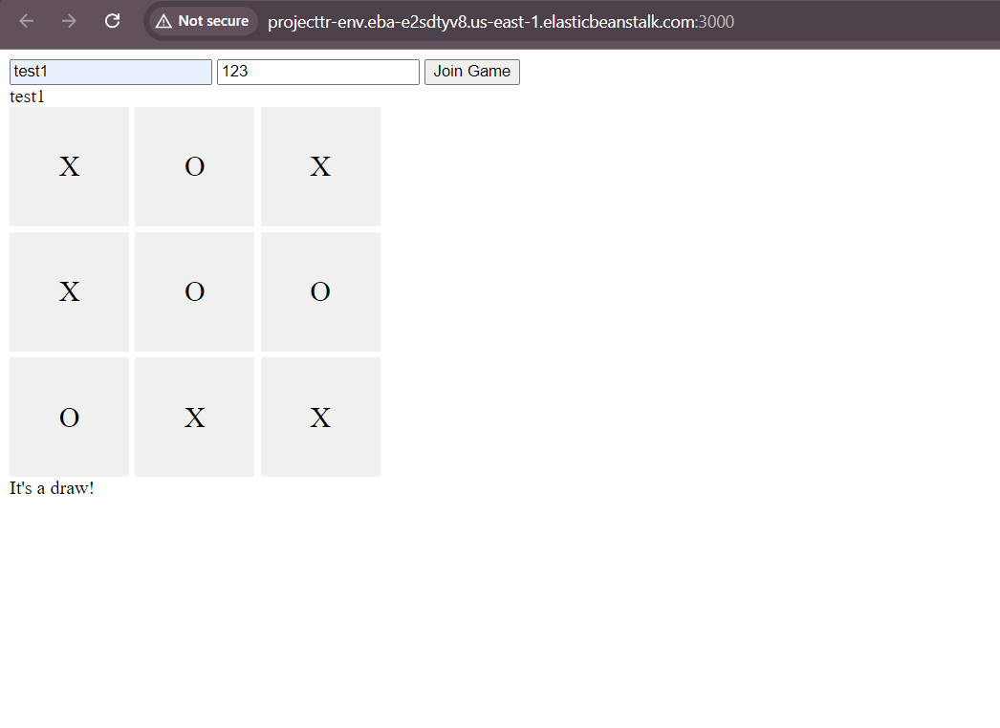

Tic-Tac-Toe Game with AWS Elastic Beanstalk and Fargate

Name: Aziz Furkan YILMAZ
Group:3
Date: 

Architecture

For deploying the Tic-Tac-Toe application using AWS Elastic Beanstalk looks well-structured for scalability and manageability. Here's a summary of the key components and interactions:

Frontend Environment:

Hosts static files (HTML, CSS, JS) of the application.
Uses Nginx as the web server.
Proxy API requests to the backend environment.
Configured to expose port 80 for HTTP.
Backend Environment:

Runs the Node.js server for API requests, user authentication, and game logic.
Uses Socket.IO for real-time communication.
Exposes port 3000 for API requests and socket connections.
Interactions:

Frontend communicates with the backend through defined endpoints.
Nginx proxies API requests from the frontend to the backend.
Socket.IO facilitates real-time communication between players.
This setup allows for a decoupled architecture, where the frontend and backend can scale independently based on demand. It also leverages Elastic Beanstalk's capabilities for easy deployment, scaling, and monitoring of the application.

Description
The developed infrastructure includes two configurations for running the containerized Tic-Tac-Toe application:

Elastic Beanstalk Configuration: Utilizes AWS Elastic Beanstalk to deploy and manage the application.
Fargate Configuration: Uses AWS Fargate to run the application within Amazon ECS.
Configured AWS Services
Elastic Beanstalk>

ec2 instance running 

s3 bucket

running application
live link:
http://projecttr-env.eba-e2sdtyv8.us-east-1.elasticbeanstalk.com:3000/
screenshot

What did you learn

During this project, I learned how to deploy a containerized application using AWS Elastic Beanstalk and AWS Fargate. The experience highlighted the differences in managing application deployment and scaling using these services.

What obstacles did you overcome?

The architecture for deploying the Tic-Tac-Toe application using AWS Fargate is designed to leverage the platform's ability to manage, scale, and monitor applications with minimal manual intervention. The primary components and their interactions are described below:

Elastic Beanstalk Environments:

Two separate environments are created within Elastic Beanstalk: one for the frontend and one for the backend. Each environment runs independently but communicates with each other through defined endpoints.

Frontend Environment:

Hosts the static files of the application, including HTML, CSS, and JavaScript.
Uses Nginx as the web server to serve the static content and proxy API requests to the backend environment.
Configured to expose port 80 to serve the application over HTTP.
Backend Environment:

Runs the Node.js server application that handles API requests, user authentication, and game logic.
Configured to use Socket.IO for real-time communication between players.
Exposes port 3000 to handle incoming API requests and socket connections.
Problems Faced with Elastic Beanstalk

Communication Between Frontend and Backend:

Problem: Setting up the frontend to correctly communicate with the backend was challenging, especially when both were deployed separately on Elastic Beanstalk environments. This led to initial issues with CORS and incorrect routing.
Solution: Ensured that the backend API URL was correctly referenced in the frontend code and configured Nginx to handle the proxying correctly.
Nginx Configuration:

Problem: Misconfigurations in the Nginx setup led to issues where static files were not served correctly or API requests were not proxied to the backend properly.
Solution: Adjusted the Nginx configuration file to properly route requests and serve static files. This included setting the correct paths and ensuring the proxy settings matched the backend server.
Environment Variables Management:

Problem: Managing environment variables securely and ensuring they were correctly picked up by both the frontend and backend was complex.
Solution: Used Elastic Beanstalk’s environment properties feature to set environment variables and updated the application code to access these variables correctly.
Deployment Errors:

Problem: Encountered deployment errors due to incorrect Docker configurations and dependencies not being installed properly within the Docker containers.
Solution: Reviewed and updated the Dockerfiles to ensure all dependencies were correctly installed and the containers were configured properly.

